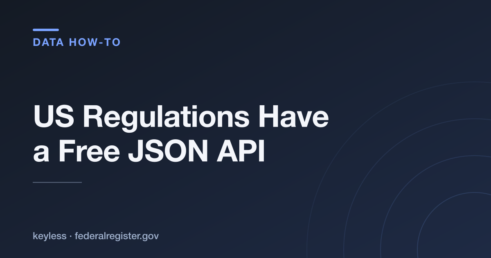

# US Federal Register JSON API — a cheatsheet



The **Federal Register** — the daily journal of the US government — publishes every final rule, proposed rule, public notice and presidential document as clean JSON through a free, **keyless** API. No sign-up, no API key, no paid tier. The only limit is a polite rate cap.

Base URL: `https://www.federalregister.gov/api/v1`

## Endpoints

| Endpoint | Purpose | Auth |
|---|---|---|
| `GET /documents.json` | List/search documents (paged). Supports `per_page` (≤1000), `page`, `order=newest`. | none |
| `GET /documents.json?conditions[term]=<q>` | Full-text search across documents. | none |
| `GET /documents/{document_number}.json` | One document in full (abstract, CFR refs, dockets, text links). | none |
| `GET /agencies.json` | All 472 agencies + their slugs (for the `agencies` filter). | none |

## Useful `conditions[...]` filters

| Filter | Example |
|---|---|
| Type | `conditions[type][]=RULE` (also `PRORULE`, `NOTICE`, `PRESDOCU`) |
| Agency | `conditions[agencies][]=environmental-protection-agency` |
| Date range | `conditions[publication_date][gte]=2026-01-01` |
| Term | `conditions[term]=artificial+intelligence` |

## Examples

```bash
# Latest 5 documents
curl "https://www.federalregister.gov/api/v1/documents.json?per_page=5&order=newest"

# EPA final rules published this year
curl "https://www.federalregister.gov/api/v1/documents.json?conditions%5Btype%5D%5B%5D=RULE&conditions%5Bagencies%5D%5B%5D=environmental-protection-agency&conditions%5Bpublication_date%5D%5Bgte%5D=2026-01-01"

# One document in full
curl "https://www.federalregister.gov/api/v1/documents/2026-14454.json"
```

Each document result carries `document_number`, `type`, `title`, `abstract`, `publication_date`, agencies, and direct `html_url` / `pdf_url` / `full_text_xml_url` links to the official text.

## Notes & gotchas

- **Keyless**, but be reasonable with volume — it's a public-good API.
- `per_page` max is **1000**; page with `page` or stream with `order=newest`.
- For **regulations already in force** (consolidated code, not the daily journal), use the sibling **eCFR** API (`ecfr.gov/api`) — same style, also keyless.
- Query arrays use bracket syntax (`conditions[agencies][]=...`); URL-encode the brackets.

## Related

- Full walkthrough article: **[dev.to/ronin13](https://dev.to/ronin13)**
- Prefer structured rows over paging? The [Federal Register Scraper](https://apify.com/ponderable_hydrometer/federal-register-scraper) on Apify wraps these endpoints — filters in, clean rows out.
